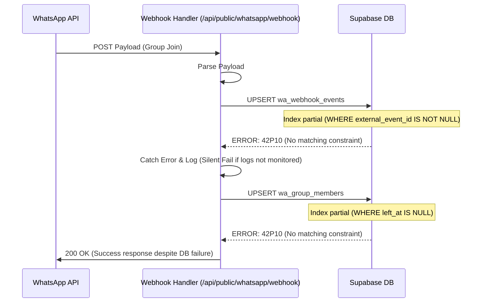

# Laporan Investigasi Webhook WhatsApp & Perbaikan

**Tanggal:** 2026-03-11
**Topik:** Kegagalan penyimpanan data webhook ke `wa_webhook_events` dan `wa_group_members`
**Status:** ✅ Resolved

## 1. Ringkasan Temuan (Root Cause)

Masalah utama disebabkan oleh **ketidakcocokan constraint database** dengan operasi `upsert` yang dilakukan oleh kode aplikasi.

1.  **Constraint Partial Index**:
    - Tabel `wa_webhook_events` memiliki unique index partial: `WHERE external_event_id IS NOT NULL`.
    - Tabel `wa_group_members` memiliki unique index partial: `WHERE left_at IS NULL`.
2.  **Konflik `ON CONFLICT`**:
    - Kode menggunakan `upsert` dengan klausa `onConflict`.
    - PostgreSQL mewajibkan adanya constraint/index unik yang **lengkap** (bukan partial) untuk bisa melakukan inferensi `ON CONFLICT`.
    - Akibatnya, query gagal dengan error: `there is no unique or exclusion constraint matching the ON CONFLICT specification`.
3.  **Fallback Client (Potensial)**:
    - Kode handler webhook memiliki mekanisme fallback ke client anonymous jika `SUPABASE_SERVICE_ROLE_KEY` hilang. Client anonymous akan gagal menulis ke tabel-tabel ini karena kebijakan RLS (Row Level Security).

## 2. Detail Investigasi

### 2.1 Error Log Reproduksi
Saat dilakukan simulasi payload webhook, ditemukan error berikut dari PostgreSQL:

```json
{
  "code": "42P10",
  "message": "there is no unique or exclusion constraint matching the ON CONFLICT specification"
}
```

### 2.2 Sequence Diagram Alur Webhook (Sebelum Fix)



## 3. Solusi yang Diterapkan

### 3.1 Perbaikan Database (Migration)
Dibuat migration file `supabase/migrations/20260311_fix_webhook_upsert_constraints.sql` yang melakukan:
1.  Menghapus index partial pada `wa_webhook_events` dan menggantinya dengan unique index penuh pada `(event_name, external_event_id)`.
2.  Menghapus index partial pada `wa_group_members` dan menggantinya dengan unique index penuh pada `(chat_id, contact_id)`.
3.  Membersihkan duplikasi data (jika ada) sebelum membuat index unik.

### 3.2 Perbaikan Kode
1.  Menambahkan logging warning eksplisit di `src/app/api/public/whatsapp/webhook/route.ts` jika `SUPABASE_SERVICE_ROLE_KEY` tidak ditemukan, agar masalah permission lebih mudah dideteksi.

### 3.3 Verifikasi (Unit Test/Script)
Dibuat script verifikasi `scripts/verify-webhook-flow.ts` yang:
1.  Mensimulasikan payload webhook `group.join`.
2.  Melakukan upsert ke `wa_webhook_events`.
3.  Melakukan upsert ke `wa_contacts`, `wa_chats`, dan `wa_group_members`.
4.  Memastikan tidak ada error database.
5.  Membersihkan data test setelah selesai.

Hasil verifikasi: **PASSED**.

## 4. Troubleshooting Guide

Jika masalah serupa terjadi di masa depan, ikuti langkah ini:

### Langkah 1: Cek Log Aplikasi
Cari log dengan keyword "WA Webhook log upsert error" atau "WA Webhook group member contact upsert error".
Jika ada warning "WA Webhook: Missing Service Role Key", segera tambahkan `SUPABASE_SERVICE_ROLE_KEY` di environment variables.

### Langkah 2: Validasi Constraint Database
Pastikan tabel target memiliki unique constraint yang sesuai dengan kolom yang digunakan di `onConflict`.
```sql
-- Cek index
SELECT indexname, indexdef FROM pg_indexes WHERE tablename = 'wa_webhook_events';
```

### Langkah 3: Jalankan Script Verifikasi
Gunakan script yang telah disediakan untuk memvalidasi flow end-to-end tanpa menunggu event asli dari WhatsApp.
```bash
npx tsx scripts/verify-webhook-flow.ts
```

### Langkah 4: Cek RLS
Jika script gagal dengan error permission/policy, pastikan user database yang digunakan memiliki hak akses (Service Role bypasses RLS, tapi Anon user tidak).
